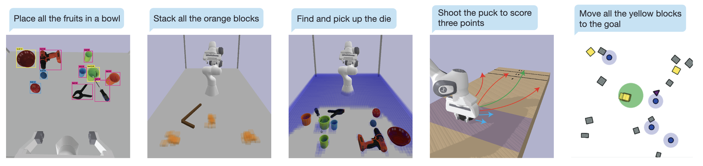

# TAMPURA

Partially Observable Task and motion planning with uncertainty and risk awareness. See our [paper](https://arxiv.org/abs/2403.10454) or [website](https://aidan-curtis.github.io/tampura.github.io/) for more details.



## Install

Install the tampura package
```
    conda create -n tampura_env python=3.11
    conda activate tampura_env
    python -m pip install -e .
    conda install -c conda-forge pygraphviz
```

# Example Notebook

See `notebooks/grasping_env.ipynb` for a simple usage example.

# Robot environments

The robot environments from the paper are in a separate [tampura_environments](https://github.com/aidan-curtis/tampura_environments) repo
